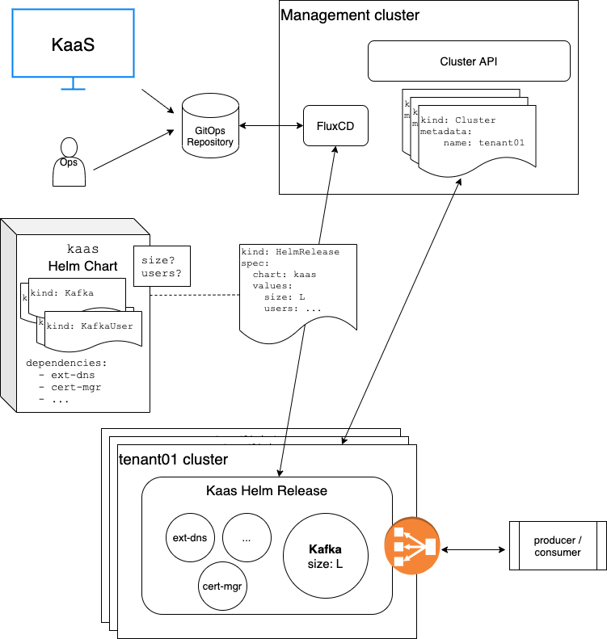

# Kafka as a Service (KaaS) on AWS

An example on how to run Apache Kafka as a SaaS product on AWS, focusing on a simple, scalable, secure, multi-tenant design which abstracts the complexities of running Kafka away from the user. An application developer shall be able to just point her Kafka producers and consumers to the KaaS service, providing only some basic preferences like desired throughput and data retention.

From operations perspective, the goal is to be able to create appropriately scaled tenants in a fully automated way. This example implements [hard multi-tenancy](#hard-multi-tenancy) on runtime level by default. If you don't require hard multi-tenancy (and want to save some infrastructure costs), the provided resources can be adjusted relatively easily to fall back to Kubernetes namespace based tenant isolation instead. The needed changes are summarized in [Changes for soft Multi-Tenancy](#changes-for-soft-multi-tenancy).

This example can be easily ported to other cloud providers and even bare-metal because only a few AWS-only components are used, which all have similar replacements on other providers. Please refer to the documentation of the individual components on how to change the configuration.

One additional design goal was to reduce the amount of custom code needed to provide a fully functional SaaS product to a minimum. It uses off-the-shelf components for solving many of the non-functional (multi-tenancy, security, scalability, operational efficiency, simplicity, ...) and functional (the core Kafka service) requirements, which are non-differentiating for a theoretical business around that SaaS product. The business should be able to spend its efforts focusing on the differentiating parts of the product.

## Table of Contents
- [Kafka as a Service (KaaS) on AWS](#kafka-as-a-service-kaas-on-aws)
  - [Table of Contents](#table-of-contents)
  - [High level Architecture](#high-level-architecture)
    - [Key aspects](#key-aspects)
  - [Runtime Platform](#runtime-platform)
  - [Apache Kafka Distribution](#apache-kafka-distribution)
  - [Multi-Tenancy](#multi-tenancy)
  - [Additional components](#additional-components)
  - [Scaling](#scaling)
  - [Security](#security)
  - [Changes for soft Multi-Tenancy](#changes-for-soft-multi-tenancy)
  - [Getting started](#getting-started)
    - [Prerequisites](#prerequisites)
    - [Create the management cluster](#create-the-management-cluster)
    - [Prepare for creating tenant clusters](#prepare-for-creating-tenant-clusters)
    - [Create a tenant cluster](#create-a-tenant-cluster)
    - [Deploy the Kaas components](#deploy-the-kaas-components)

## High level Architecture


### Key aspects
- There are two interaction points for operations, frontend applications or user-facing APIs with the KaaS backend: A central GitOps repository and the Kubernetes API of the management cluster.
- The central GitOps repository stores the current configuration of all KaaS tenants, i.e. the Cluster API `Cluster` resources for the tenant Kubernetes clusters and the `HelmRelease` resources for the tenant KaaS configuration (e.g. the parameters of the deployed Kafka cluster).
- Frontends, APIs and operators can talk to the Kubernetes API of the management cluster to e.g. query tenant create / change / delete status.
- The [FluxCD](https://fluxcd.io/) GitOps controller applies `Cluster` resources from the Git repository to the management cluster in order for the [Cluster API](https://cluster-api.sigs.k8s.io/) controller to create / change / delete tenant Kubernetes clusters. It applies `HelmRelease` resources to the specified tenant clusters to deploy the tenant components.
- A central `kaas` helm chart is used for providing an abstraction layer over a full KaaS tenant component deployment, which can be parametrized with e.g. the tenant sizing and user configuration.
- Users can point their Kafka producers and consumers to the load balanced and TLS enabled Kafka listeners on the tenant clusters
## Runtime Platform

An obvious choice for the runtime platform is [**Kubernetes**](https://kubernetes.io/) because of its straight-forward sclability, reliability and security properties and because its the de-facto standard for container orchestration (yes, we use containers).

## Apache Kafka Distribution

Kafka, as a complex stateful system, can be run in many different ways and configurations. We are chosing the [**Strimzi Kafka on Kubernetes**](https://strimzi.io/) distribution because it seems to be the most advanced and feature rich open source and thus free to use option for running Kafka on Kubernetes. There are comparable and even more advanced commercial options available.

## Multi-Tenancy

This example is implementing hard multi-tenancy on runtime level by running the tenant Kafka clusters on separate Kubernetes clusters. The assumption is that a KaaS customer would require a higher level of isolation of her Kafka installation and the data in it than a single Kubernetes cluster can provide out of the box e.g. by separating tenants on Kubernetes namespace level.

The largest drawback of this solution is obviously the added infrastracture costs for running a full Kubernetes control plane and a set of dedicated worker nodes per tenant (compute and storage can't be shared between multiple tenants and thus the amount of unused resources can be higher). The significance of this drawback is inversely proportional to the size of the tenant clusters. For tenants with hundreds of worker nodes the additional resources for running the Kubernetes control plane are usually neglectable. Thus it can be postulated that this example is mainly focusing on having rather large tenants.

Please see [Changes for soft Multi-Tenancy](#changes-for-soft-multi-tenancy) for a theoretical consideration of how to change this example for running your tenants on a single Kubernetes cluster with namespace-level tenant isolation.
## Additional components

- TLS certificate management: [**cert-manager**](https://cert-manager.io/) with [**Let's Encrypt**](https://letsencrypt.org/)
- DNS management: [**external-dns**](https://github.com/kubernetes-sigs/external-dns) with [**AWS Route53**](https://aws.amazon.com/route53)
- K8s cluster management (see [Multi-Tenancy](#multi-tenancy)): [**Cluster API**](https://cluster-api.sigs.k8s.io/)
- Monitoring and alerting: [**Prometheus Operator**](https://github.com/prometheus-operator/prometheus-operator)

## Scaling
While the tenant Kubernetes clusters can be resized easily by changing their `Cluster` resources in the management cluster, scaling Kafka is harder. Kafka is a complex stateful system and doesn't provide elastic scaling out of the box. For e.g. adding or removing Kafka brokers, heavy rebalancing operations must be executed which impact cluster performance while they are running. Without having sophisticated scaling logic for Kafka (some commercial Kafka offerings like [Confluent](https://www.confluent.io/) provide these) the aim should be to size the Kafka cluster appropriately from the beginning.

## Security

Data is being persisted using Kubernetes `PersistentVolumeClaims` which will create encrypted EBS volumes. All data in motion is encrypted by using TLS-secured external endpoints. The Strimzi Kafka operator supports client certificate based user authentication by default.

## Changes for soft Multi-Tenancy
For running the tenants on a single Kubernetes cluster with namespace level isolation all Cluster API parts in this example can be omitted. Apart from that, the tenant deployment `HelmRelease`s need to be changed to not point to remote cluster anymore but to create a separate namespace for the new tenant. For initally providing sufficient resources for the new tenant, the Kubernetes cluster must of course be resized appropriately on tenant creation. The central `kaas` helm chart doesn't need to contain cluster-level components like `cert-manager` and `external-dns` anymore, they only need to be deployed once to the cluster.

## Getting started

How to get this example running yourself.

### Prerequisites

- An AWS account with appropriate permissions to create the neccessary resources
- A DNS zone managed by Route 53 which can be used to create the neccessary endpoints
- Install the following CLI tools
    - [`aws`](https://docs.aws.amazon.com/cli/latest/userguide/)
    - [`eksctl`](https://eksctl.io/)
    - [`clusterctl`](https://cluster-api.sigs.k8s.io/user/quick-start.html#install-clusterctl)
    - [`clusterawsadm`](https://github.com/kubernetes-sigs/cluster-api-provider-aws/releases)
    - [`flux`](https://toolkit.fluxcd.io/get-started/#install-the-flux-cli)
- A Git repository you want to use for your tenant cluster configuration. This will be used by the FluxCD GitOps operator on the management cluster. In the example we use this repository (subpath [tenants](tenants)).

### Create the management cluster

First, the management Kubernetes cluster needs to be created. This is the cluster which you mainly interact with directly and where the lifecycle of the tenant (workload) clusters will be managed. We use an EKS [Elastic Kubernetes Service (EKS)](https://aws.amazon.com/eks) cluster for that.

1. Setup your AWS credentials using e.g. `aws configure`.
2. [Import or create an SSH key pair for EC2](https://docs.aws.amazon.com/AWSEC2/latest/UserGuide/ec2-key-pairs.html#prepare-key-pair)
3. Create the management cluster with
    ```
    eksctl create cluster \
      --name kaas-mgmt \
      --region us-east-1 \
      --with-oidc \
      --ssh-access \
      --ssh-public-key <key> \
      --managed
    ```
   and wait for it to be ready.
4. In order to set the appropriate IAM configuration for Cluster API, run
    ```
    clusterawsadm bootstrap iam create-cloudformation-stack
    ```
5. Set an environment variable for putting the IAM credentials in a Kubernetes secret
    ```
    export AWS_B64ENCODED_CREDENTIALS=$(clusterawsadm bootstrap credentials encode-as-profile)
    ```
6. Initialize the AWS Cluster API provider on your management cluster
    ```
    clusterctl init --infrastructure=aws
    ```

7. Install FluxCD to your management cluster and connect it to this Github repo (for other Git providers see the [FluxCD bootstrap docs](https://toolkit.fluxcd.io/guides/installation/#bootstrap))
    ```
    export GITHUB_USER=danielm0hr
    export GITHUB_TOKEN=<acces-token>

    flux bootstrap github \
    --owner=$GITHUB_USER \
    --repository=aws-kafka-as-a-service \
    --branch=main \
    --path=./tenants \
    --personal
    ```

### Prepare for creating tenant clusters

Tenant clusters will use [`external-dns`](https://github.com/kubernetes-sigs/external-dns) for creating DNS endpoints in Route53. Create an IAM policy which allows access to your Route53 zone by creating a `policy.json` file

    {
      "Version": "2012-10-17",
      "Statement": [
        {
          "Effect": "Allow",
          "Action": [
            "route53:ChangeResourceRecordSets"
          ],
          "Resource": [
            "arn:aws:route53:::hostedzone/<zone-id>"
          ]
        },
        {
          "Effect": "Allow",
          "Action": [
            "route53:ListHostedZones",
            "route53:ListResourceRecordSets"
          ],
          "Resource": [
            "*"
          ]
        }
      ]
    }

and creating the policy with

    aws iam create-policy --policy-name k8s-ext-dns-route53 --policy-document file://policy.json

For each tenant cluster we will then create an IAM role which has the above policy attached.

### Create a tenant cluster

Creating the tenant cluster is a two step operation: First, the cluster is created by creating a `Cluster` configuration in the Flux repository. After the cluster is ready, the appropriate IAM policies for `external-dns` are created (the neccessary values are not known before cluster creation) and the tenant deployments are initiated by putting a `HelmRelease` resource into the Flux repository. The `HelmRelease` is using the `spec.kubeconfig` field for applying it to the newly created tenant cluster.

1. Specify some further environment variables for `clusterctl`:
    ```
    export AWS_REGION=us-east-1
    export AWS_SSH_KEY_NAME=<key>
    export AWS_CONTROL_PLANE_MACHINE_TYPE=t3.large
    export AWS_NODE_MACHINE_TYPE=r5.xlarge
    ```
    Note: _r5.xlarge_ is the recommended AWS node type for Kafka clusters on AWS according to https://eventsizer.io/.
2. Create the tenant cluster configuration by running
    ```
    clusterctl config cluster <tenant-name> --kubernetes-version v1.19.7 --worker-machine-count=<worker-nodes> > tenant-cluster.yaml
    ```
    and put it into the GitOps repository to you pointed FluxCD above. See [`tenants/example-tenant01/example-tenant01.yaml`](tenants/example-tenant01/example-tenant01.yaml) for an example cluster configuration. Set `<worker-nodes>` to at least the number of nodes your Kafka cluster needs to fulfill your throughput requirements. Use e.g. https://eventsizer.io/ for determining the right number. When providing a self-service UI to the users the cluster size would need to be computed when requesting a new tenant based on the user input about desired throughput.

    The FluxCD source controller will detect the `Cluster` resource in the repository and apply it to the management cluster. Cluster API will then create the tenant cluster according to the configuration.
3. After the tenant cluster is up and running, create an IAM role for `external-dns` to be able to create DNS entries in Route53. Attach the policy you created above to that role following [these instructions](https://docs.aws.amazon.com/eks/latest/userguide/create-service-account-iam-policy-and-role.html#create-service-account-iam-role).

### Deploy the Kaas components

__Note: This is not implemented yet.__

1. Put a `HelmRelease` resource into the Flux repository, which installs the [`kaas`](charts/kaas) chart to the tenant cluster while providing appropriate values for sizing and naming. The [`kaas`](charts/kaas) chart aggregates all tenant cluster components (external-dns, cert-manager, the Kafka operator, the Kafka cluster resources, etc) into one central, versionable configuration which can be parametrized. The chart only surfaces the values, which need to be adjusted per tenant: The Kafka cluster sizing paramters and the users to create on the Kafka cluster. When providing self-service UI for tenant creation, the values for these parameters need to be calculated based on user input about desired throughput, data retention and user accounts. See [`tenants/example-tenant01/kaas.yaml`](tenants/example-tenant01/kaas.yaml) for an example.
    ```
    apiVersion: helm.toolkit.fluxcd.io/v2beta1
    kind: HelmRelease
    metadata:
      name: example-cluster01
      namespace: default
    spec:
      values:
        kafkaNodes: <nodes>
        kafkaStoragePerNode <storage>
        kafkaUsers: [<users>]
      kubeConfig:
        secretRef:
          name: example-tenant01-kubeconfig
      chart:
        spec:
          chart: ./charts/kaas
          version: "0.1.0"
          sourceRef:
            kind: GitRepository
            name: kaas
      install:
        remediation:
          retries: -1
    ```